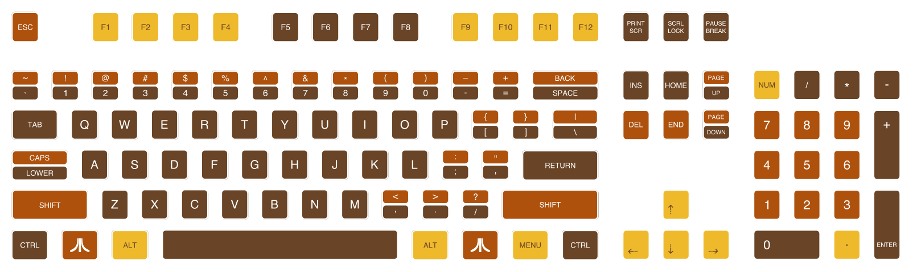

### Atari 400 styled WASD V2 

ANSI 104 Keyboard layout you can use with WASD keyboards, custom layout 
tool. (Use the SVG file, not the png.)

### License 

DWTFYL (do what the f**k you like license.) 

Note: I release this design to the public domain, I accept no responsibility for any ill effects in using this keyboard layout design, including but not limited to, misprint, loss, damage, an overwhelming urge to buy an Atari 400, which could subsequently end in divorce, loss of life, or serious injury.  

Have fun.
